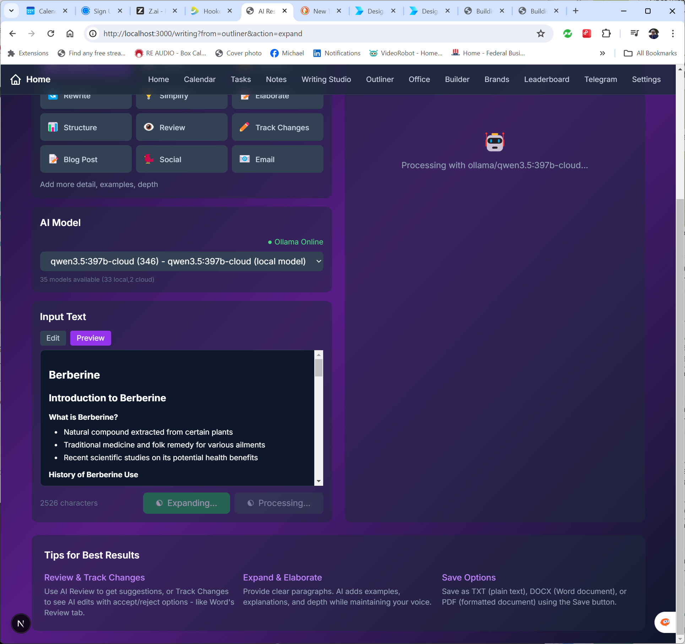
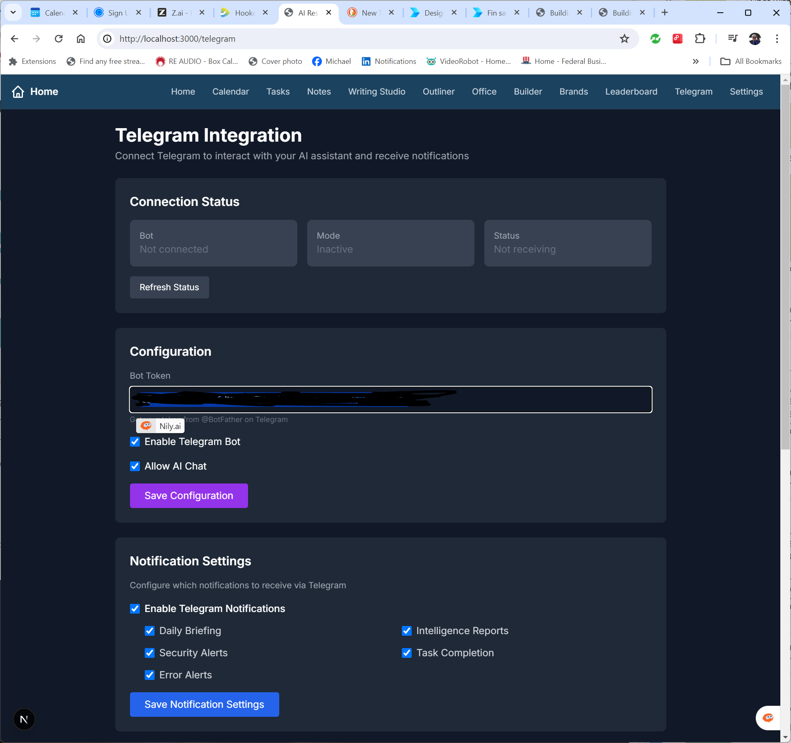
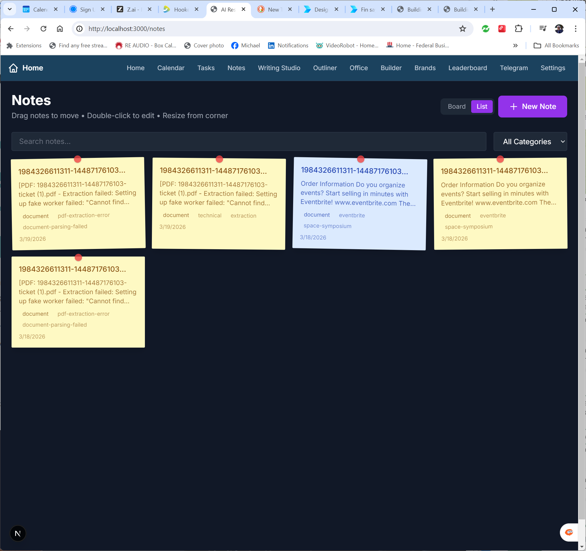

# PersonalAI Dashboard

**Build your own private, local-first AI productivity system — no subscriptions, no data leaks, no vendor lock-in.**

A complete AI Operating System that runs on your laptop or desktop. Includes a powerful Research Assistant, Writing Studio, Visual Builder, Document Generator, Brand Workspace, Task Scheduler, Calendar, Telegram integration, and more.

**This is Michael C. Barnes' 5th book on Generative AI** — the full 384-page book is included **free** with the project.


---

## 📖 Free Book Included

**Building Your AI Dashboard: The Complete Guide**  
*From Zero to Enterprise-Grade AI — On Your Own Personal Computer*

- Written for complete beginners (no programming experience required)
- Step-by-step instructions to build everything you see here
- Full explanations of the Model Message Bus and Vector Lake

**[📥 Download the Full Book (PDF)](./docs/Building_Your_AI_Dashboard.pdf)**

---

## ✨ Live Screenshots

### AI Research Assistant


### Visual Builder (AI-generated UIs)


### Writing Studio + Outliner




### Brand Workspace (NotebookLM-style)


### LLM Leaderboard & Free Token Sources


### Task Scheduler


### Calendar with AI Briefing


### Telegram Integration


### Notes System


---

## Core Innovations (Patent Pending)

- **Model Message Bus** — Revolutionary self-assessing hierarchical LLM communication. Small models intelligently escalate to larger ones and validate the final response locally.
- **Vector Lake** — Automatic, ever-growing memory system that turns every interaction into permanent contextual knowledge.

These two concepts (developed by Michael C. Barnes) are the foundation of the entire architecture and are currently undergoing provisional patent protection.

---

## Key Features

- AI Research Assistant with streaming responses
- Visual Builder — generate UIs and forms with natural language
- Writing Studio with Outliner, Rewrite, Expand, and Grammar tools
- Document Generator (Word, Excel, PowerPoint)
- Brand Workspace for multi-brand knowledge management
- Task Scheduler (natural language recurring tasks)
- Calendar with AI-generated briefings
- Telegram Bot + Notifications
- LLM Leaderboard with free token sources
- Notes system (Kanban-style)
- Self-reflection and system improvement suggestions
- Full local-first design (your data never leaves your machine)

---

## 🚀 Quick Start

```bash
git clone https://github.com/norhtecmbarnes-dot/PersonalAI-Dashboard.git
cd PersonalAI-Dashboard
npm install

# Start with Docker (recommended)
docker compose up

# Or start with npm
npm run dev
```

Open http://localhost:3000 in your browser.

**For local AI models** (free, private):
```bash
ollama pull llama3.2
npm run dev
```

---

## 📖 Documentation

- **[User Guide](./docs/USER-GUIDE.md)** — Complete walkthrough with screenshots
- **[Book (PDF)](./docs/Building_Your_AI_Dashboard.pdf)** — Full 384-page guide
- **[Book (Online)](https://designrr.page/?id=493295&token=3520346906&type=FP&h=9144)** — Web version

---

## Technologies

- **Next.js 14** + TypeScript
- **Ollama** (local models)
- **Docker** + containerized deployment
- **SQLite** + Vector Lake
- **Tailwind** + modern UI

---

## The Model Message Bus

```
┌─────────────────────────────────────────────────────────────┐
│                    MODEL MESSAGE BUS                         │
│  Tier 1: Local Small (llama3.2:latest)   ← Triage & simple  │
│  Tier 2: Local Large (qwen3.5:9b)                            │
│  Tier 3: Cloud Fast (groq/llama-3.1-8b)                      │
│  Tier 4: Cloud Smart (gpt-4o, claude-3.5, glm-5)            │
└─────────────────────────────────────────────────────────────┘
```

Self-assessment + budget awareness + bidirectional validation = truly novel in open source.

---

## License

- **Code**: MIT License — use freely for any purpose
- **Book**: CC BY-SA 4.0 — share and adapt with attribution

---

Star ⭐ this repo if you believe in local-first AI that saves money and protects your data.

**Made with ❤️ by Michael C. Barnes (@norhtecmbarnes)**