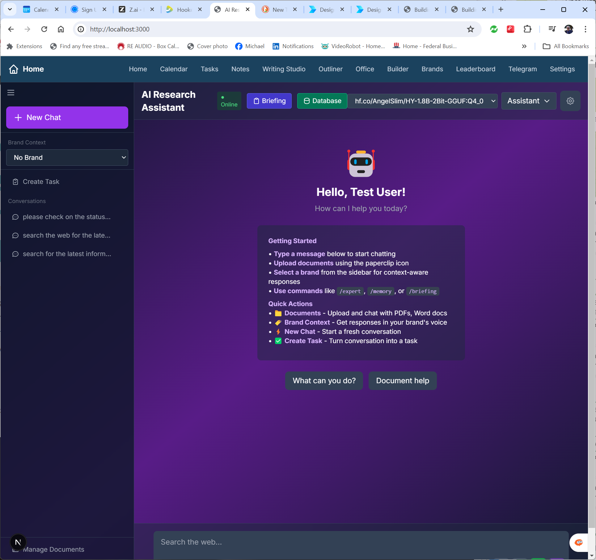
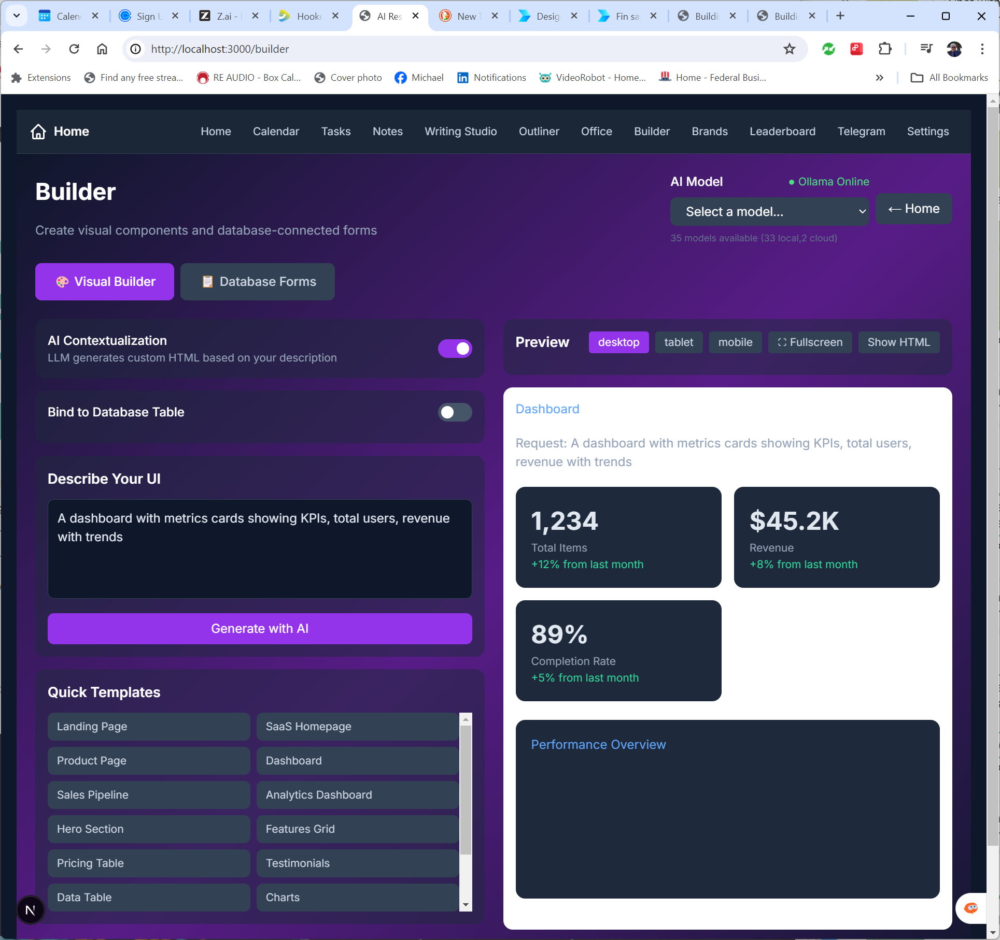
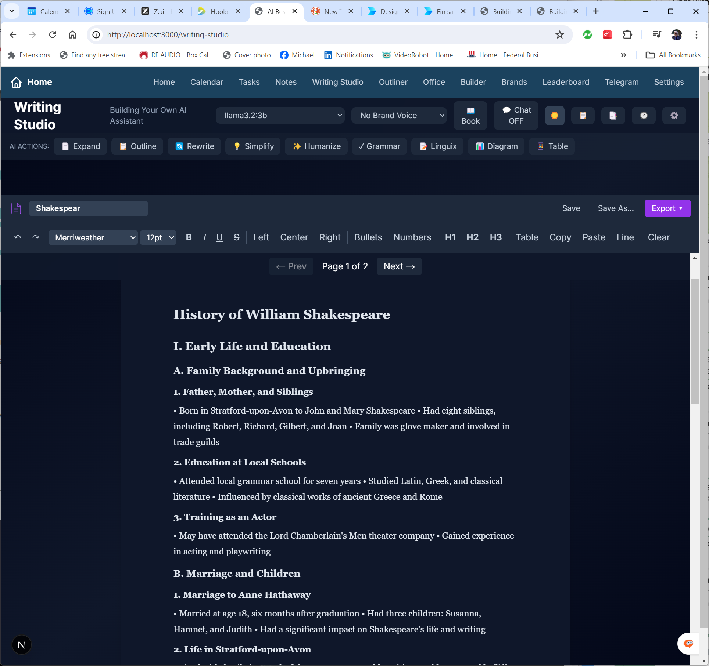
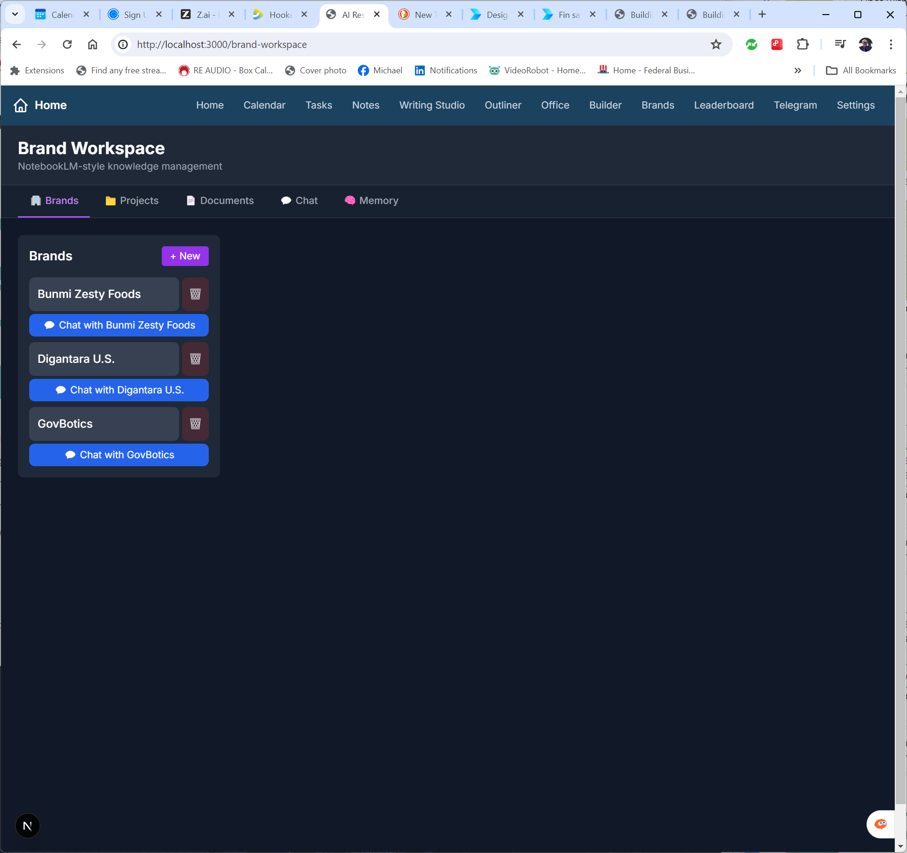
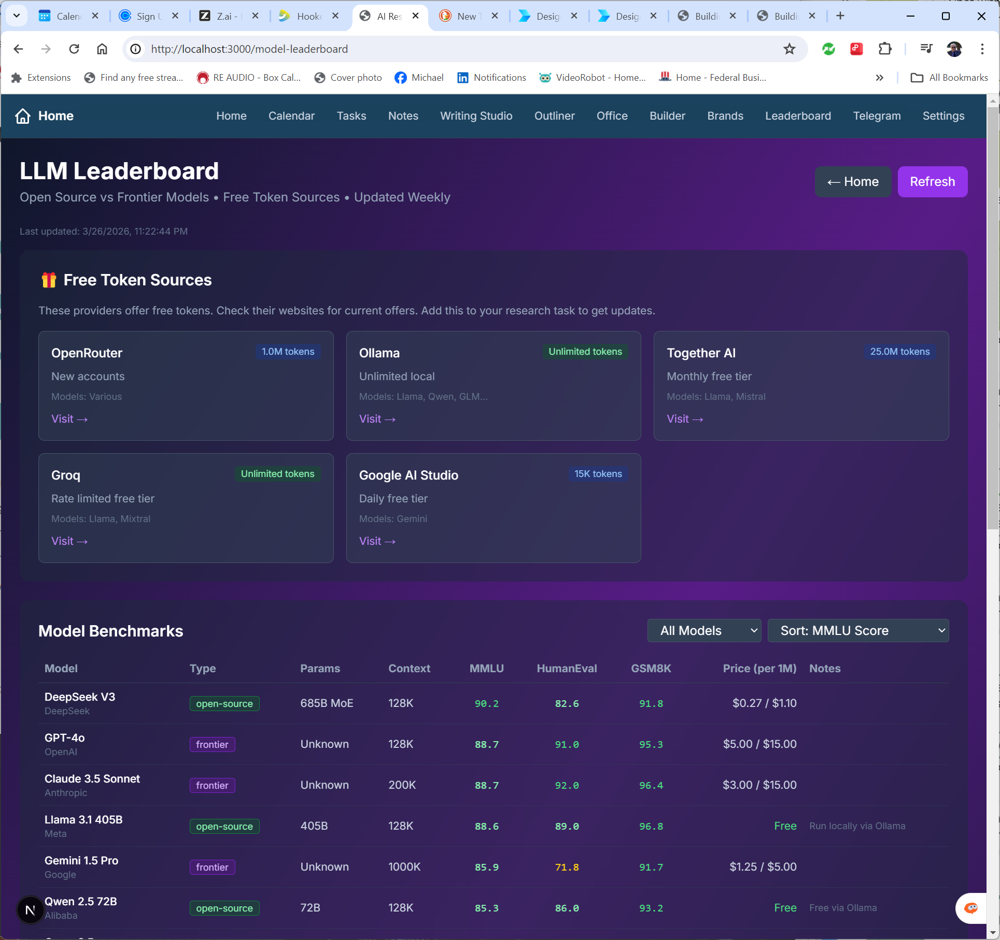
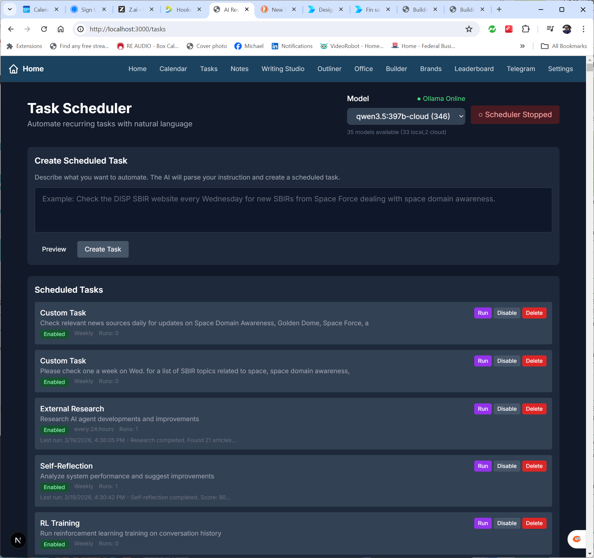
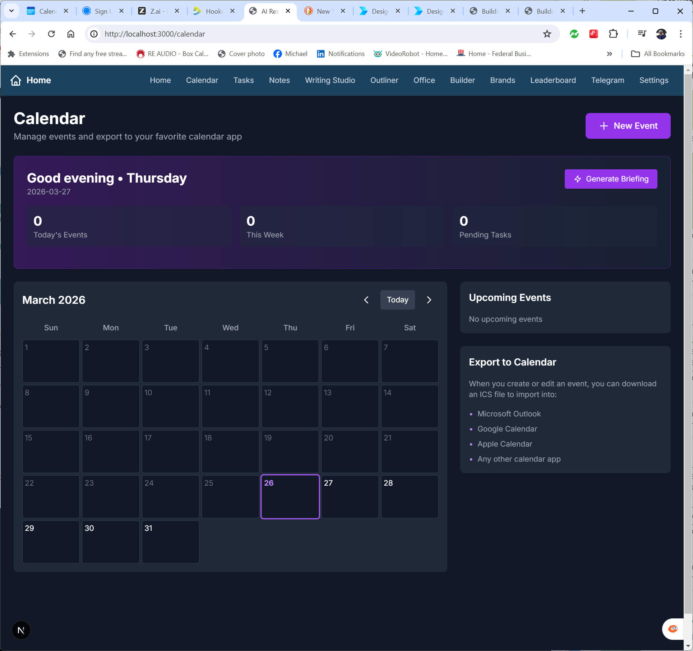

# PersonalAI Dashboard

**Build your own private, local-first AI productivity system — no subscriptions, no data leaks, no vendor lock-in.**

A complete AI Operating System that runs on your laptop. Includes Research Assistant, Writing Studio, Visual Builder, Document Generator, Brand Workspace, Task Scheduler, Calendar, Telegram integration, and more.

**Michael C. Barnes' 5th book on Generative AI** — the full 384-page book is included **free**.

## 📖 Free Book

**[Building Your AI Dashboard: The Complete Guide](book/Building_Your_AI_Dashboard.pdf)**  
*From Zero to Enterprise-Grade AI — On Your Own Personal Computer*

## 🎬 MiniMax H3 Director Dashboard

A chat-driven AI video director. Talk to the Auteur in plain English, get MiniMax H3 video with synchronized audio. Includes 4-step prototype mode, shot chaining for long-form video, and an avatar studio (local + cloud).

**[Director Dashboard For Dummies — Full Guide](docs/DIRECTOR-FOR-DUMMIES.md)**

Quick start: double-click `start-director.bat` → open `http://localhost:3000/minimax-h3`

**Key Features:**
- 🎭 **The Auteur** — AI director persona writes scripts in "Minimax Generation Mode" format
- ⚡ **Prototype / Final** — 4-step turbo LoRA for fast iteration, 30-step for final quality
- 🔗 **Shot chaining** — last frame feeds next shot for seamless long-form video
- 🧑‍💼 **Avatar Studio** — local (Qwen-Image + VocalLab + Wan InfiniteTalk) or cloud (HeyGen)
- 🚀 **One-click startup** — `start-director.bat` launches Ollama + ComfyUI + dashboard together

## ✨ Live Screenshots

**AI Research Assistant**  


**Visual Builder**  


**Writing Studio**  


**Brand Workspace**  


**LLM Leaderboard**  


**Task Scheduler**  


**Calendar**  


**Telegram Integration**  


**Notes**  


## Core Innovations (Patent Pending)

- **Model Message Bus** — Self-assessing hierarchical LLM communication (Michael C. Barnes, with inspiration from Randolph Hill)
- **Vector Lake** — Automatic growing memory system (Michael C. Barnes)

## 🚀 Quick Start

```bash
git clone https://github.com/norhtecmbarnes-dot/PersonalAI-Dashboard.git
cd PersonalAI-Dashboard
npm install
cp .env.example .env.local

# Start with Docker (recommended)
docker compose up

# Or start with npm
npm run dev
```

Open http://localhost:3000

## 📖 Documentation

- **[User Guide](docs/USER-GUIDE.md)** — Complete walkthrough
- **[Book (PDF)](book/Building_Your_AI_Dashboard.pdf)** — Full 384-page guide
- **[Book (Online)](https://designrr.page/?id=493295&token=3520346906&type=FP&h=9144)** — Web version

## Key Features

- AI Research Assistant with streaming responses
- Visual Builder — generate UIs and forms with natural language
- Writing Studio with Outliner, Rewrite, Expand, and Grammar tools
- Document Generator (Word, Excel, PowerPoint)
- Brand Workspace for multi-brand knowledge management
- Task Scheduler (natural language recurring tasks)
- Calendar with AI-generated briefings
- Telegram Bot + Notifications
- LLM Leaderboard with free token sources
- Notes system (Kanban-style)
- Self-reflection and system improvement suggestions
- Full local-first design (your data never leaves your machine)

## Technologies

- **Next.js 14** + TypeScript
- **Ollama** (local models)
- **Docker** + containerized deployment
- **SQLite** + Vector Lake
- **Tailwind** + modern UI

## 🚀 The Model Message Bus — Core Innovation (Patent Pending)

The **Model Message Bus** is the heart of the entire PersonalAI Dashboard architecture and Michael C. Barnes' most significant contribution.

Instead of using a traditional central orchestrator, the Model Message Bus lets the **smallest local model act as its own intelligent triage orchestrator**.

### How It Works

1. **Self-Assessment** — The smallest model (Tier 1) receives the query and evaluates: Can I answer this? Would a larger model do better? What's the token cost?
2. **Intelligent Escalation** — If overwhelmed, it escalates to the appropriate higher tier with full context.
3. **Bidirectional Validation** — The higher-tier model processes and returns. The small model validates and formats before delivery.
4. **Token Budget Awareness** — Real-time cost tracking prefers local models when possible.

### The 4-Tier Hierarchy

```
┌─────────────────────────────────────────────────────────────┐
│                    MODEL MESSAGE BUS                         │
│                                                             │
│  Tier 1: Local Small (gemma3:4b or llama4:scout-small)     │
│  └── Triage, preprocessing, simple queries                  │
│                                                             │
│  Tier 2: Local Large (llama4:scout or llama4:maverick)      │
│  └── Medium complexity, document analysis, writing          │
│                                                             │
│  Tier 3: Cloud Fast (Groq-hosted Llama 4 fast variants)    │
│  └── Speed-critical escalations                              │
│                                                             │
│  Tier 4: Cloud Smart (gpt-5.4, claude-opus-4.6, gemini-2.5) │
│  └── Complex reasoning, high-accuracy, creative tasks       │
└─────────────────────────────────────────────────────────────┘
```

### Why This Architecture Is Unique

- **No central orchestrator** — decision to escalate happens inside the model
- **Bidirectional flow** — powerful model lifts, small model retains final control
- **Self-aware escalation** — learns what it can handle locally over time
- **True cost intelligence** — token budget considered at every step
- **Auditability** — every escalation logged with reasoning and tokens

---

## 🌊 Vector Lake — Your AI's Living, Growing Memory (Patent Pending)

**Vector Lake** is the intelligent memory layer that makes the Dashboard truly adaptive. While most AI systems forget everything when a conversation ends, Vector Lake turns every interaction into permanent, searchable knowledge.

### How Vector Lake Works

1. **Automatic Ingestion** — Every query, document, and result is converted to vectors and stored
2. **Semantic Understanding** — Find connections across different documents and conversations
3. **Smart Caching** — Check Vector Lake first, reducing token usage dramatically
4. **Continuous Learning** — The lake grows smarter with every use

### Technical Implementation

```
User Query → Model Message Bus → Vector Lake (Check first)
                                ↓
                        Semantic Search → Relevant past knowledge
                                ↓
                      Enriched Context → Final Response
                                ↓
                      New Result → Automatically added to Vector Lake
```

**Core Technologies:**
- SQLite for local storage (no server needed)
- Vector embeddings via Ollama or @xenova/transformers
- Cosine similarity for semantic search
- Automatic metadata logging (timestamps, source, model, tokens)

**Key Files:**
- `src/lib/storage/vector-lake.ts` — Main Vector Lake service
- `src/lib/system/manager.ts` — Integration with Model Message Bus

### Key Benefits

- **Massive Token Savings** — Repeated questions answered from cache
- **True Long-Term Memory** — AI never forgets your documents or research
- **Self-Improvement** — Intelligence reports analyze trends from the lake
- **Privacy** — All vectors stay on your machine

---

**Patent Pending** — Model Message Bus and Vector Lake are original concepts developed by Michael C. Barnes, with inspiration from Randolph Hill.

## License

- **Code**: MIT License — use freely for any purpose
- **Book**: CC BY-SA 4.0 — share and adapt with attribution

---

Star ⭐ this repo if you believe in local-first AI that saves money and protects your data.

**Made with ❤️ by Michael C. Barnes (@norhtecmbarnes)**